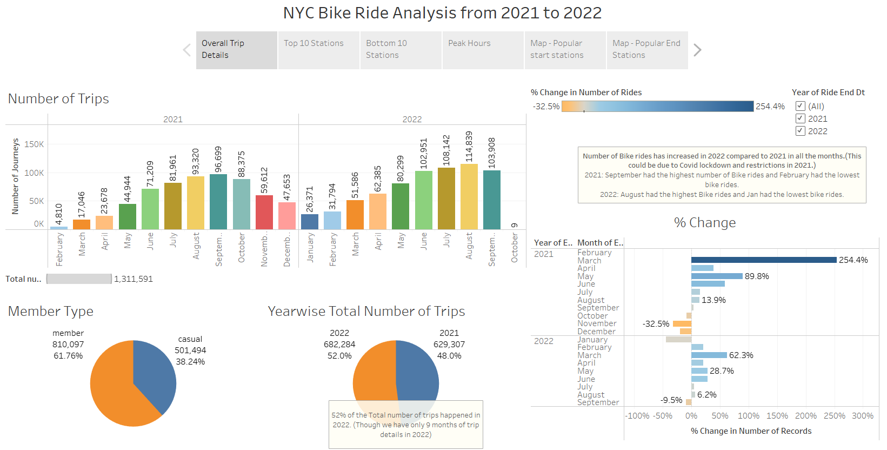
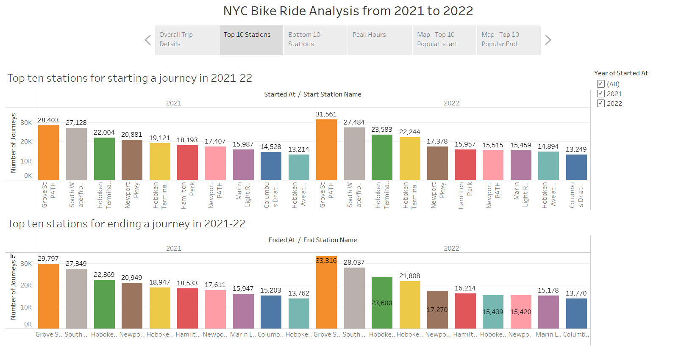
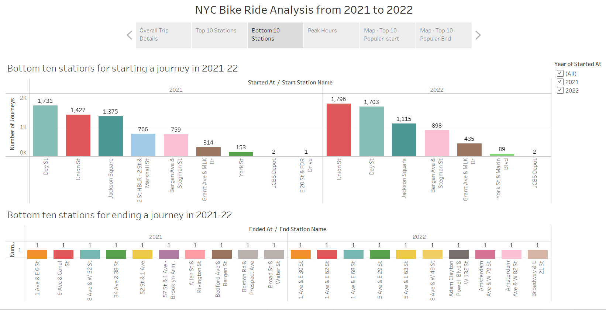
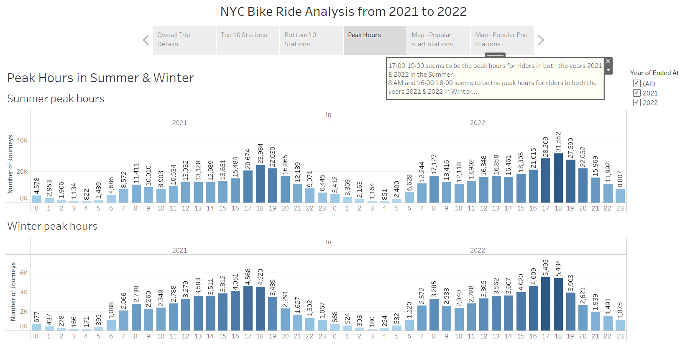
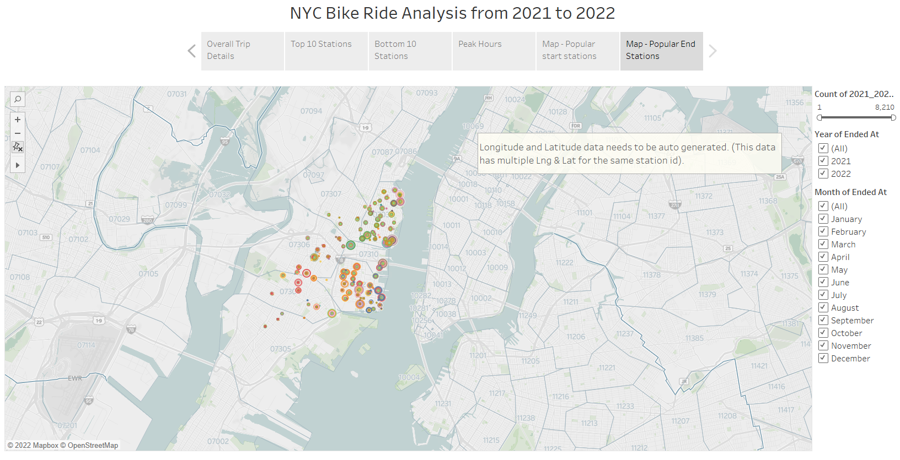

# Tableau-BikeRide-Visualization

## Data Source

Monthly CSV files (Feb 2021- Sep 2022) were collected from [Citi Bike Data](https://www.citibikenyc.com/system-data) webpage.

## Visualizations

https://public.tableau.com/app/profile/baby.indra.nandagopal/viz/Tableau_BikeRide_Analysis/NYCBikeRideAnalysis?publish=yes

## Analysis

1. Overall Trip Details

Total number of records were `1.3 millions - 629K in 2021 and 682K in 2022(Till Sep)`. Number of Bike rides in 2021 is lower than 2022 for all the months. This could be due to the Covid lockdown and restrictions in New York city in 2021.
`2021:` September had the highest number of Bike rides and February had the lowest number of bike rides.
`2022:` August had the highest Bike rides and Jan had the lowest bike rides.
People seem to ride more bikes in the summer than in the winter. The possible reason could be that people are not willing to ride outside in winter due to the cold weather. 

2.  Top ten Stations
Top ten stations for both ending and starting a journey are Grove St PATH, South waterfront walkway - Sinatra Dr & 1st, and Hoboken Terminal - Hudson St & Hudson Pl.

3.  Bottom 10 Stations

4.  Peak Hours
17:00-19:00 seems to be the peak hours for riders in both the years 2021 & 2022 in the Summer.
8 AM and 16:00-18:00 seem to be the peak hours for riders in both the years 2021 & 2022 in Winter.
More people ride bikes in the summer than in the winter months.

5.  Map - Popular Start Stations

6.  Map - Popular End Stations

